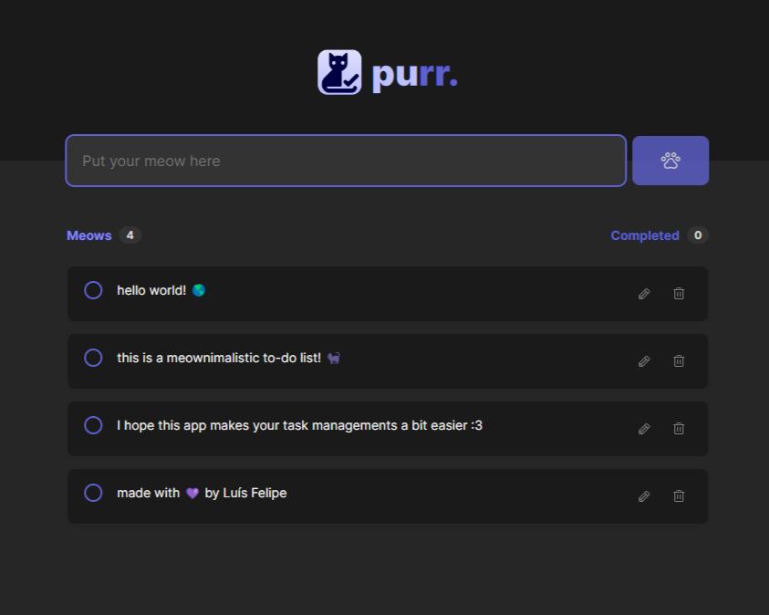
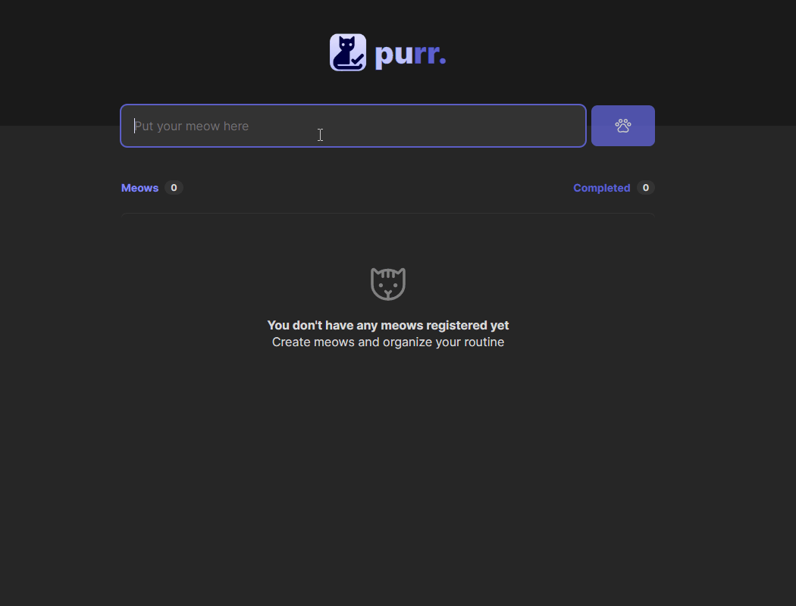
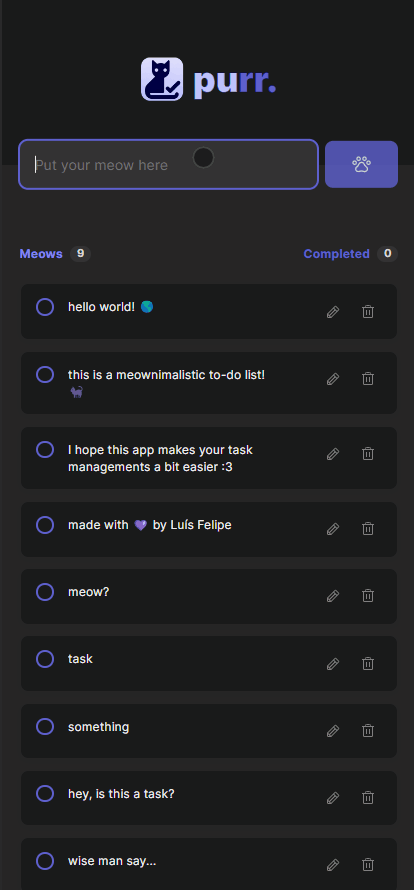

<div align="center"> 

# purr. 🐾

</div>

<div align="center">
    
    
    
    
    
</div>

<p align="center">A meownimalistic to-do list for funny daily task management. 📝✨</p>

<h4 align="center">
    <a href="#-features">Features</a> •
    <a href="#-hotkeys">Hotkeys</a> •
    <a href="#start-your-meows">Try It Out</a> •
    <a href="#-credits">Credits</a> •
    <a href="#excelsior-code--by-luís-felipe">Author</a>
</h4>
<br>

## 📌 Features
- [x] Simplistic and adorable cat-themed design.
- [x] Input field is autofocused to quickly jot down tasks.
- [x] Tasks persist between sessions with local storage.
- [x] Reorder tasks with a simple drag-and-drop interface.
- [x] Easily delete tasks.
- [x] Edit tasks on the fly – because plans change!
- [x] Hotkeys for efficient task management.
<br>

## 👾 Hotkeys 
- [x] `Enter`: Focus the new task box.
- [x] `Del`: Confirm task deletion.
- [x] `Esc`: Exit any pop-up window.
- [x] `Double Click`: Edits the selected task.
<br>

### 🐈‍⬛ 🐈‍⬛ 🐈‍⬛ 
## [Start your meows](https://purr-dot.web.app/)
<div align="center">
    <br>
    
    
</div>

## 
<br>

## 💾 Getting Started
Ensure you have the following installed to use purr:
- [GIT](https://git-scm.com/)
- [Node.js](https://nodejs.org/en/)

- [pnpm](https://pnpm.io/) --optional

Clone the repository and jump straight into task management:
```bash
# Clone the repository
git clone https://github.com/luisf-csdev/purr.git

# Navigate to the project directory
cd purr

# Install dependencies
npm install
## or
pnpm install

# Start the application
npm run dev 
## or 
pnpm dev

# purr will be running on <http://localhost:5173>
```
<br>

## 💽 Tech Stack
<div>
    
    
    
    
</div>
<be>

## 👤 Credits
Challenge proposed by [Rocketseat](https://www.rocketseat.com.br/) 🚀

UI inspired by the design of [Millena Martins](https://www.linkedin.com/in/millenakmartins/) 🎨
## 

<div align="center">

#### Excelsior code 💜 by Luís Felipe

[🪐 Take a look at my LinkedIn 🪐](https://www.linkedin.com/in/luisf-csdev/)
</div>
